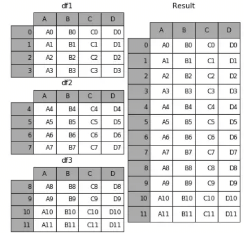
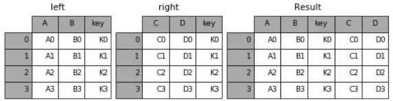
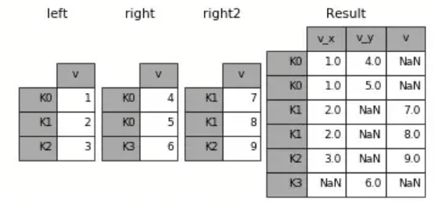

## 目录

[**1. pandas并行包**](#pandas并行包)

[**2. pandas dataframe手动创建**](#pandas_dataframe手动创建)

[**3. pandas dataframe中apply用法**](#pandas_dataframe中apply用法)

[**4. pandas dataframe中map用法**](#pandas_dataframe中map用法)

[**5. groupby用法**](#groupby用法)

[**6. explode用法**](#explode用法)

[**7. sort用法**](#sort用法)

[**8. left join用法**](#left_join用法)

[**9. reset_index用法**](#reset_index用法)

[**10. pandas to_csv字段和值加引号操作**](#to_csv字段和值加引号操作)

[**11. pd concat、merge、join来合并数据表**](#合并数据表)

[**12. 数据透视表（Pivot Tables）**](#数据透视表)

[**13. shuffle**](#shuffle)

[**14. dataframe交换列的顺序**](#dataframe交换列的顺序)

[**15. dataframe设置两个条件取值**](#dataframe设置两个条件取值)

[**16. dataframe用h5格式保存**](#dataframe用h5格式保存)

[**17. assign用法**](#assign用法)

[**18. 用一列的非空值填充另一列对应行的空值**](#用一列的非空值填充另一列对应行的空值)

[**19. dataframe修改值**](#dataframe修改值)

[**20. dataframe表格填充**](#dataframe表格填充)

---

### pandas_dataframe手动创建

手动创建dataframe
```python
arr = np.array([['John','Lily','Ben'],[11,23,56]])
df = pd.DataFrame(arr.transpose(),columns=['name','age'])
```


### pandas_dataframe中apply用法

现在想看一下地址中含有-和,的数据有哪些可以进行如下操作： 
```python
df[df.address.apply(lambda x: ('-' in list(x)) and (',' in list(x)))]
```

> 可以看basic中apply函数的用法

### pandas_dataframe中map用法

```python
df["season"] = df.season.map({1: "Spring", 2 : "Summer", 3 : "Fall", 4 :"Winter" })
# 把数字映射成string
```

### groupby用法

[**用法举例一**]
```python
gr = df.groupby(by='EID')
gr.agg({'BTBL':'max','BTYEAR':'count'}).reset_index() # 常见的max, min, count, mean, first, nunique
```
||EID|BTBL|BTYEAR
|--|--|--|--
|0|4|0.620|2011
|1|38|0.700|2013
|2|51|0.147|2002
 
这里对df根据EID进行groupby，然后根据字段BTBL, BTYEAR两个字段进行聚合，然后reset_index

[**用法举例二**]

||EID|ALTERNO|ALTDATE|ALTBE|ALTAF
|--|--|--|--|--|--
|1|399|05|2014-01|10|50
|2|399|12|2015-05|NaN|NaN
|3|399|12|2013-12|NaN|NaN
|4|399|27|2014-01|10|50
|5|399|99|2014-01|NaN|NaN

groupby EID然后想要统计一些唯一的月份有几个   
```python
# 方法一
def f(ll):
    fun = lambda x : x.split('-')[1]
    return len(set(map(fun,list(ll))))
# lambda套lambda写法
f = lambda ll : len(set(map(lambda x : x.split('-')[1],list(ll))))

p = pd.merge(data0, data2.groupby('EID').agg({'ALTERNO':'nunique','ALTDATE':f}).reset_index().rename(columns={'ALTERNO':'alt_count','ALTDATE':'altdate_nunique'}), how='left',on='EID')

#方法二
data2['year'] = data2.ALTDATE.apply(lambda x : x.split('-')[0])
data2['month'] = data2.ALTDATE.apply(lambda x : x.split('-')[1])
data2.groupby('EID').agg({'month':'nunique'}).reset_index().rename(columns={'month':'month_nunique'})
```

### explode用法

**1. 比如有个dataframe的结构如下**

||city|community|longitude|latitude|address
|--|--|--|--|--|--
|1|上海|东方庭院|121.044|31.1332|复兴路88弄,珠安路77弄,浦祥路377弄

执行如下语句：
```python
data.drop('address',axis=1).join(data['address'].str.split(',',expand=True).stack().reset_index(level=1,drop=True).rename('address'))

# spark中的explode用法
spark_df = spark_df.select(spark_df['city'],spark_df['community_org'],spark_df['community'],\
spark_df['longitude'],spark_df['latitude'],(explode(split('address',','))).alias('address'),spark_df['villagekey'])
```
||city|community|longitude|latitude|address
|--|--|--|--|--|--
|1|上海|东方庭院|121.044|31.1332|复兴路88弄|
|2|上海|东方庭院|121.044|31.1332|珠安路77弄|
|3|上海|东方庭院|121.044|31.1332|浦祥路377弄|

**2. pandas0.25版本以上有explode的函数**<br>

|col_a|col_b
||--|--
|0|10|[111, 222]
|1|11|[333, 444]

```python
df.explode('col_b') #得到如下表
```


### sort用法

注：df.sort()已经deprecated，以后可用df.sort_values()
```python
data3.sort_values(['EID','B_REYEAR'],ascending=True) #默认是升序排，先根据EID然后再根据B_REYEAR进行排序
```

### left_join用法
```python
data.merge(data1, how='left', on='id_code')
```

### reset_index用法
```python
data.reset_index(drop=True)
```

### to_csv字段和值加引号操作
to_csv中的参数quoting: int or csv.QUOTE_* instance, default 0
控制csv中的引号常量。
可选 QUOTE_MINIMAL(0), QUOTE_ALL(1), QUOTE_NONNUMERIC(2) OR QUOTE_NONE(3)

### 合并数据表
如果你熟悉SQL，这几个概念对你来说就是小菜一碟。不过不管怎样，这几个函数从本质上来说不过就是合并多个数据表的不同方式而已。当然，要时刻记着什么情况下该用哪个函数也不是一件容易的事，所以，让我们一起再回顾一下吧。<br>
<br>
concat()可以把一个或多个数据表按行（或列）的方向简单堆叠起来（看你传入的axis参数是0还是1咯）。
```python
import pandas as pd
df1 = pd.DataFrame(np.ones((3,4))*0, columns=['a','b','c','d'])
df2 = pd.DataFrame(np.ones((3,4))*1, columns=['a','b','c','d'])
df3 = pd.DataFrame(np.ones((3,4))*2, columns=['a','b','c','d'])
pd.concat([df1, df2, df3], axis=0, ignore_index=True)
pd.concat([df1, df2, df3], axis=1, ignore_index=True)
```


merge()将会以用户指定的某个名字相同的列为主键进行对齐，把两个或多个数据表融合到一起。<br>\


join()和merge()很相似，只不过join()是按数据表的索引进行对齐，而不是按某一个相同的列。当某个表缺少某个索引的时候，对应的值为空（NaN）<br>


### 数据透视表
最后也最重要的是数据透视表。如果你对微软的Excel有一定了解的话，你大概也用过（或听过）Excel里的“数据透视表”功能。Pandas里内建的pivot_table()函数的功能也差不多，它能帮你对一个数据表进行格式化，并输出一个像Excel工作表一样的表格。实际使用中，透视表将根据一个或多个键对数据进行分组统计，将函数传入参数aggfunc中，数据将会按你指定的函数进行统计，并将结果分配到表格中。<br>
```python
from pandas import pivot_table
>>> df
   A   B   C      D
0  foo one small  1
1  foo one large  2
2  foo one large  2
3  foo two small  3
4  foo two small  3
5  bar one large  4
6  bar one small  5
7  bar two small  6
8  bar two large  7

>>> table = pivot_table(df, values='D', index=['A', 'B'],
...                     columns=['C'], aggfunc=np.sum)
>>> table
          small  large
foo  one  1      4
     two  6      NaN
bar  one  5      4
     two  6      7
```

### shuffle
```python
# 方法一
from sklearn.utils import shuffle  
df = shuffle(df)
# 方法二
df.sample(frac=1).reset_index(drop=True)
```

### dataframe交换列的顺序
```python
reorder_col = ['label','doc','query']
df = df.loc[:, reorder_col]
```

### dataframe设置两个条件取值

```python
df[(df.Store == 1) & (df.Dept == 1)]
```

### dataframe用h5格式保存

```python
# 普通格式存储
h5 = pd.HDFStore('data/data1_2212.h5','w')
h5['data'] = data1
h5.close()
# 压缩格式存储
h5 = pd.HDFStore('data/data1_2212.h5','w', complevel=4, complib='blosc')
h5['data'] = data1
h5.close()
# 读取h5文件
data=pd.read_hdf('data/data1_2212.h5',key='data')
```

### assign用法

assign相当于给df增加一列，返回新的df copy<br>
Assign new columns to a DataFrame, returning a new object
(a copy) with the new columns added to the original ones.

```python
def iv_xy(x, y):
    # good bad func
    def goodbad(df):
        names = {'good': (df['y']==0).sum(),'bad': (df['y']==1).sum()}
        return pd.Series(names)
    # iv calculation
    iv_total = pd.DataFrame({'x':x.astype('str'),'y':y}) \
      .fillna('missing') \
      .groupby('x') \
      .apply(goodbad) \
      .replace(0, 0.9) \
      .assign(
        DistrBad = lambda x: x.bad/sum(x.bad),
        DistrGood = lambda x: x.good/sum(x.good)
      ) \
      .assign(iv = lambda x: (x.DistrBad-x.DistrGood)*np.log(x.DistrBad/x.DistrGood)) \
      .iv.sum() # iv核心公式，最后iv.sum()对每个group加总求和，即为该特征的iv值
    # return iv
    return iv_total
```

### 用一列的非空值填充另一列对应行的空值

```python
df.loc[df['new_subject'].isnull(),'new_subject']=df[df['new_subject'].isnull()]['subject']
``` 

### dataframe修改值

```python
df.loc[df.A < 4,'A'] = [100,120,140]
# or
df.loc[df.content_id=='x6mbO2rHfU3hTej4','sentiment_tmp'] = 1
```

### dataframe表格填充

```python
df.fillna(method='ffill', axis=1).fillna(method='ffill')
```


