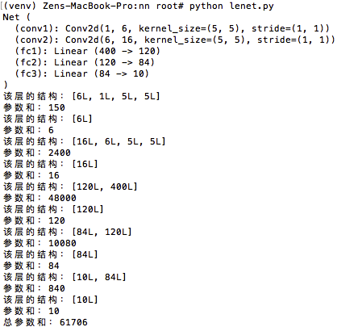
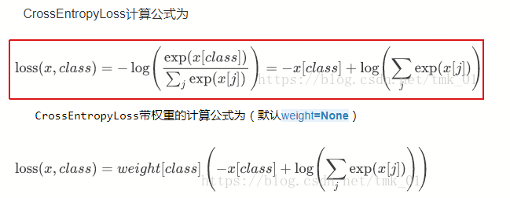

# 目录

[**1. pytorch入门知乎**](#入门知乎网址)

[**2. 用pytorch构建第一个神经网络**](#用pytorch构建第一个神经网络)

 - 回归
 - 分类
 - 快速搭建
 - 保存提取
 - 批训练
 - Optimizer 优化器

[**3. pytorch入门之构造一个小型CNN**](#lenet)

[**4. pytorch CrossEntropyLoss的计算过程**](#pytorch_crossentropyloss)


---

### 入门知乎网址

https://www.zhihu.com/question/55720139

### 用pytorch构建第一个神经网络

**I.回归**

[完整代码](simple_regression.py)

这里构建了net以后
```python
net = Net(n_feature=1, n_hidden=10, n_output=1)
print(list(net.parameters()))
'''
    这里net一共一个hidden layer，打印出四个参数，分别是Weight,Bias,gradWeight,GradBias
    如果是两个hidden layer,那么会有六个参数，分别是Weight,Bias,Weight,Bias,gradWeight,GradBias
    注：最后两个(最后一层)是求完梯度后的权重和bias
'''
```
**II.分类**

[完整代码](simple_classifier.py)

**III.快速搭建**
```python
class Net(torch.nn.Module):
    def __init__(self, n_feature, n_hidden, n_output):
        super(Net, self).__init__()
        self.hidden = torch.nn.Linear(n_feature, n_hidden)
        self.predict = torch.nn.Linear(n_hidden, n_output)

    def forward(self, x):
        x = F.relu(self.hidden(x))
        x = self.predict(x)
        return x

net1 = Net(1, 10, 1)   # 这是我们用这种方式搭建的 net1
```
我们用class继承了一个torch中的神经网络结构, 然后对其进行了修改, 不过还有更快的一招, 用一句话就概括了上面所有的内容！
```python
net2 = torch.nn.Sequential(
    torch.nn.Linear(1, 10),
    torch.nn.ReLU(),
    torch.nn.Linear(10, 1)
)
```
[快速搭建法 莫烦](https://morvanzhou.github.io/tutorials/machine-learning/torch/3-03-fast-nn/)

**IV.保存提取**
```python
torch.save(net1, 'net.pkl')  # 保存整个网络
torch.save(net1.state_dict(), 'net_params.pkl')   # 只保存网络中的参数 (速度快, 占内存少)
```
load之前保存的整个网络
```python
def restore_net():
    # restore entire net1 to net2
    net2 = torch.load('net.pkl')
    prediction = net2(x)
```
load之前保存的网络中的参数
```python
def restore_params():
    # 新建 net3
    net3 = torch.nn.Sequential(
        torch.nn.Linear(1, 10),
        torch.nn.ReLU(),
        torch.nn.Linear(10, 1)
    )

    # 将保存的参数复制到 net3
    net3.load_state_dict(torch.load('net_params.pkl'))
    prediction = net3(x)
```
**V. 批训练**

[完整代码](batch_train.py)

> Torch中提供了一种帮你整理你的数据结构的好东西, 叫做DataLoader, 我们能用它来包装自己的数据, 进行批训练<br>

> DataLoader是torch给你用来包装你的数据的工具。所以你要将自己的(numpy array或其他)数据形式装换成Tensor, 然后再放进这个包装器中。使用DataLoader有什么好处呢? 就是他们帮你有效地迭代数据<br>


**VI. Optimizer 优化器**

[完整代码](optimizer.py)

### LeNet

[完整代码](lenet.py)

运行完该代码我们得到下图:



该网络有5层神经元，第一层是1到6的卷积层，第二层是6到16的卷积层，第三层到第5层均为全连接层。第一层的参数计算是6x1x5x5=150，
当然别忘了还有bias=6，所以第一层的参数总量是150+6=156。以此类推，总参数和为61706个。

> 注意：torch.nn只接受mini-batch的输入，也就是说我们输入的时候是必须是好几张图片同时输入<br>
> 例如：nn. Conv2d 允许输入4维的Tensor：n个样本 x n个色彩频道 x 高度 x 宽度<br>

### pytorch_crossentropyloss

CrossEntropyLoss公式如下图片格式：<br>
<br>
CrossEntropyLoss公式如下markdown格式：<br>

$ \text{loss}(x, class) = -\log\left(\frac{\exp(x[class])}{\sum_j \exp(x[j])}\right) = -x[class] + \log\left(\sum_j \exp(x[j])\right) $

```python
import torch
import torch.nn as nn
import math
loss = nn.CrossEntropyLoss()
input = torch.randn(3, 5, requires_grad=True) # 样本数是3个
target = torch.empty(3, dtype=torch.long).random_(5) # 三个样本数对应三个label
output = loss(input, target)

print("输入为3个5类:")
print(input)
print("要计算loss的类别:")
print(target)
print("计算loss的结果:")
print(output)

first = [0,0,0]
for i in range(3):
    first[i] -= input[i][target[i]]
second = [0,0,0]
for i in range(3):
    for j in range(5):
        second[i] += math.exp(input[i][j])
res = 0
for i in range(3):
    res += first[i] +math.log(second[i])
print("自己的计算结果：")
print(res/3)
#计算的结果是一样的
```