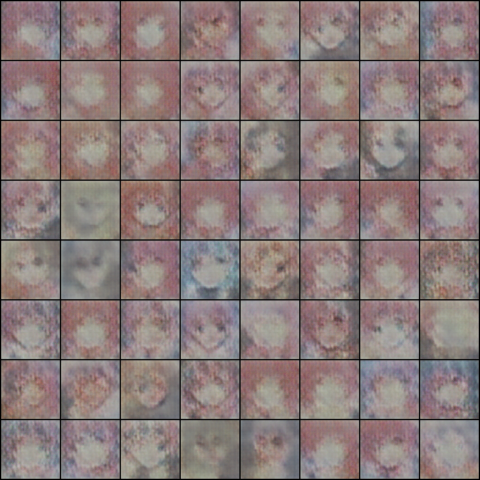

# 用GAN实现一个简单的动漫头像

说明： 
 - checkpoints存放的训练好的模型参数 
 - data中放的是数据，这里数据需要再包一个文件夹 
 - imgs中存放的是结果图片 
 - model.py中存放的是两个模型 
 - gpu_gan_train.ipynb是整个训练过程
 
 
 
输入512个100\*1\*1的噪声，选最好的64个3\*96\*96的图片，20个epoch的结果如下： 

