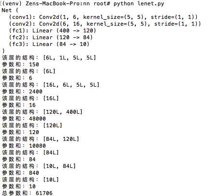

# 目录

[**1. pytorch入门知乎**](#入门知乎网址)

[**2. 用pytorch构建第一个回归神经网络**](#用pytorch构建第一个回归神经网络)

[**3. pytorch入门之构造一个小型CNN**](#lenet)

---

### 入门知乎网址

https://www.zhihu.com/question/55720139

### 用pytorch构建第一个回归神经网络

[完整代码](simple_regression.py)

### LeNet

[完整代码](lenet.py)

运行完该代码我们得到下图:

该网络有5层神经元，第一层是1到6的卷积层，第二层是6到16的卷积层，第三层到第5层均为全连接层。第一层的参数计算是6x1x5x5=150，
当然别忘了还有bias=6，所以第一层的参数总量是150+6=156。以此类推，总参数和为61706个。

> 注意：torch.nn只接受mini-batch的输入，也就是说我们输入的时候是必须是好几张图片同时输入 
> 例如：nn. Conv2d 允许输入4维的Tensor：n个样本 x n个色彩频道 x 高度 x 宽度 
