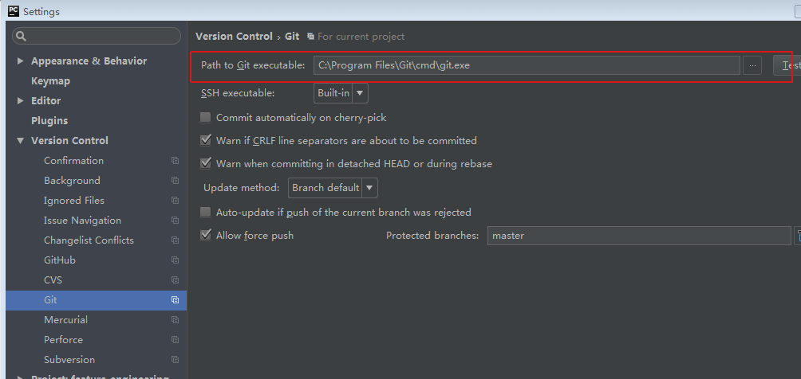
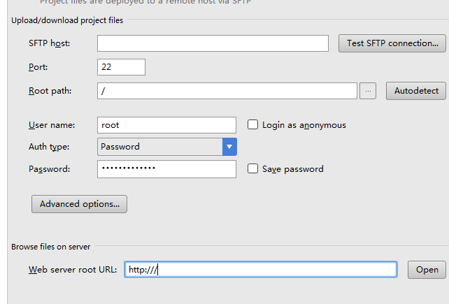
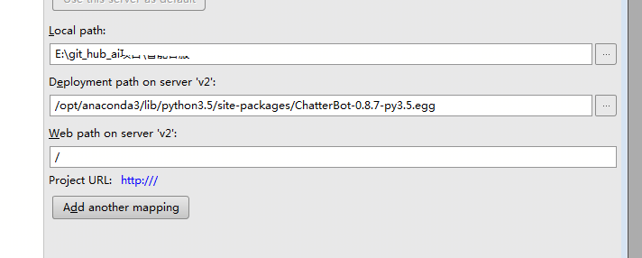
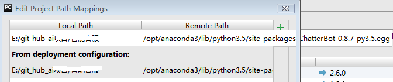
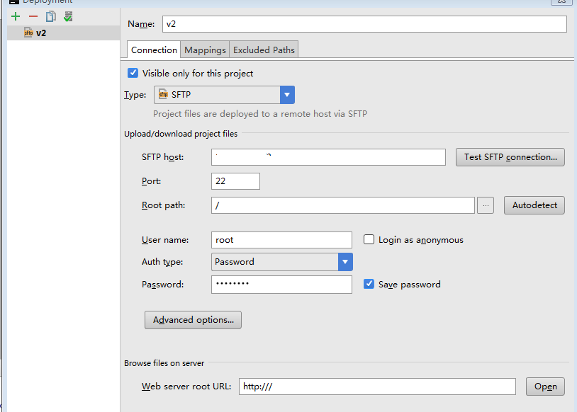
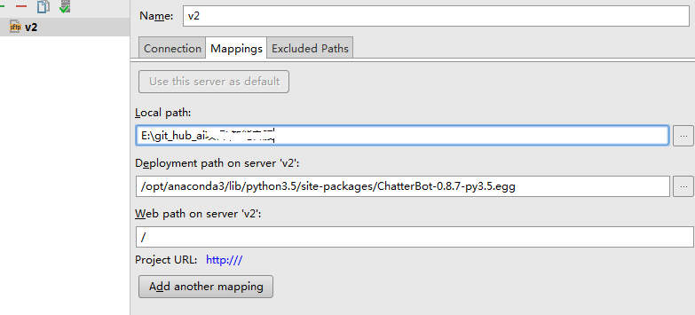
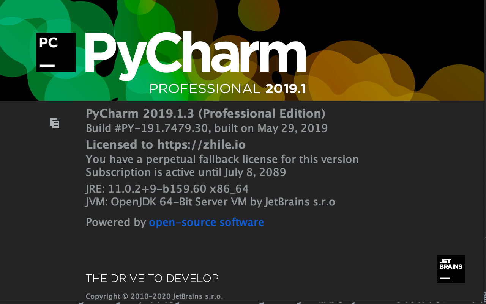

# 1. pycharm github

pubilic email: binzhouchn@gmail.com

**每次github push东西之前，先pull一下**

[github教程](https://www.liaoxuefeng.com/wiki/0013739516305929606dd18361248578c67b8067c8c017b000)

简单的步骤：<br>
**首先:** 安装好git, macOS和windows不一样<br>

**第1步：** 创建SSH Key。在用户主目录下，看看有没有.ssh目录，如果有，再看看这个目录下有没有id_rsa和id_rsa.pub这两个文件，
如果已经有了，可直接跳到下一步。如果没有，打开Shell（Windows下打开Git Bash），创建SSH Key：<br>
```
ssh-keygen -t rsa -C "binzhouchn@gmail.com"
```
你需要把邮件地址换成你自己的邮件地址，然后一路回车，使用默认值即可，由于这个Key也不是用于军事目的，所以也无需设置密码。
macOS存放密匙路径:  /Users/binzhou/.ssh/id_rs<br>
如果一切顺利的话，可以在用户主目录里找到.ssh目录，里面有id_rsa和id_rsa.pub两个文件，这两个就是SSH Key的秘钥对，id_rsa是私钥，
不能泄露出去，id_rsa.pub是公钥，可以放心地告诉任何人。

**第2步：** 登陆GitHub，打开“Account settings”，“SSH Keys”页面：
然后，点“Add SSH Key”，填上任意Title，在Key文本框里粘贴id_rsa.pub文件的内容：<br>
当然，GitHub允许你添加多个Key。假定你有若干电脑，你一会儿在公司提交，一会儿在家里提交，只要把每台电脑的Key都添加到GitHub，就可以在每台电脑上往GitHub推送了。

最后友情提示，在GitHub上免费托管的Git仓库，任何人都可以看到喔（但只有你自己才能改）。所以，不要把敏感信息放进去。

**第3步：** 如果想在pycharm中使用git可以先配置pycharm（以windows为例的话）<br>




# 2. pycharm远程服务器生成项目及调试代码

1. 打开pycharm -> File -> Settings -> Project Interpreter<br>
2. 点Project Interpreter轮子，选择add remote选择SSH然后填入用户密码等apply再OK
3. Tools -> Deployment -> Configuration点击左上角的加号（取名字v2并选SFTP）
4. Configuration中配置Connection和Mappings如下图所示








# 3. pycharm中遇到的一些问题

1. pycharm运行app.py需要在configuration->Environment variables中加入 LANG=en_US.utf-8;LC_ALL=en_US.utf-8

# 4. pycharm永久激活

 - 下载激活插件：jetbrains-agent.jar，并将jetbrains-agent.jar放到PyCharm安装目录bin下面，例如/Applications/PyCharm.app/Contents/bin
 - 首次安装的Pycharm，需要点击激活窗口的Evaluate for free免费试用，然后再创建一个空项目进入主页窗口。
 - 在菜单栏Help中选择Edit Custom VM Options…       在弹框中选择Create
 - 在最后一行添加：-javaagent:/Applications/PyCharm.app/Contents/bin/jetbrains-agent.jar
 - 修改完成后，重启Pycharm，点击菜单栏中的 “Help” -> “Register”，输入永久激活码完成完成激活，这里的激活码与方法一种激活码不同
 - 查看有效期的步骤：点击：Help->About，这里可以看到你的pycharm有效期到2089年了，是不是soeasy



# 5. xxx


 